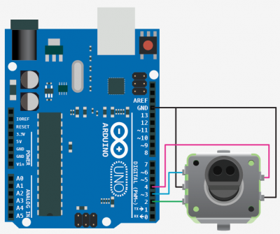

#Linear Stage Controller v0.1 source#

03/01/2016
Phil McCarthy

---

##Overview##

This repository contains platform independent C++ code written for the Qt framework to control a (virtual at this point) linear stage using a software user interface, as well as an Arduino sketch which allows an Arduino with a rotary encoder to be used to also control the linear stage. 

##Build instructions##

Get [Qt Creator](http://www.qt.io/download-open-source/) for your particular platform, open the .pro project file and build it.
Configure the serial port name your particular Arduino uses in hardwareserialui.cpp.

For the Arduino sketch, build and upload the sketch using at least 1.6.4 of the Arduino IDE, and attach the rotary encoder to the development board using this pinout:

Note only one rotary encoder is supported on the Uno R3 using interrupts (recommended way of handling encoders). Might want to consider using a board with additional interrupts if more control dials are needed.

Don't have the Arduino IDE's serial monitor open when you run the software otherwise it won't work.

##Legal stuff##

Don't build Qt libraries statically with the code as that makes everything LGPL. Probably want to link to Qt dynamically and choose some license for this code - TBD.

##TO DO##

- Plug in actual back end C/C++ library to control the stage.
- Make serial port of front end UI hardware be easily selectable from software GUI
- Develop non linear transform (currently just X^2 on control delta per 50ms sample period) and add adjustable sensitivity